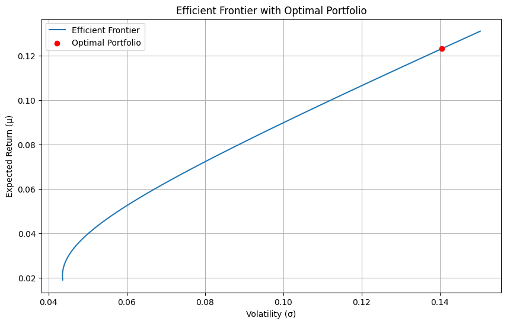
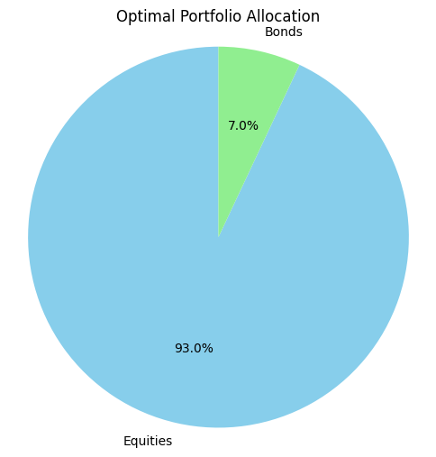

# Robo-Advisor Portfolio Optimization of Stocks and Bonds

## Overview

This project builds a simple robo-advisor designed to create optimal portfolios of stocks and bonds based on individual risk aversion. The robo-advisor leverages data from Yahoo Finance to perform mean-variance optimization and recommends portfolios tailored to users' risk profiles, which are derived from a questionnaire assessing their willingness and ability to take risks. I've created this project for educational purposes at INCAE Business School, for the courses of FINTECH and Portfolio Management.

## Table of Contents

- [Project Structure](#project-structure)
- [Installation](#installation)
- [Data Source](#data-source)
- [Usage](#usage)
- [Methodology](#methodology)
  - [Data Processing](#data-processing)
  - [Mean-Variance Optimization](#mean-variance-optimization)
  - [Risk Assessment Questionnaire](#risk-assessment-questionnaire)
  - [Risk Aversion Mapping](#risk-aversion-mapping)
  - [Optimal Portfolio Calculation](#optimal-portfolio-calculation)
- [Results](#results)
- [License](#license)
- [Acknowledgments](#acknowledgments)

## Project Structure

```
robo-advisor-portfolio-optimization/
├── data/              # Directory for storing raw and processed data
├── docs/              # Documentation files
├── figures/           # Figures generated from the analysis
├── README.md          # Project documentation
├── .gitignore         # Files and directories to ignore in git
├── requirements.txt   # Required packages
└── Modulo_S.6_Robo_Advisor.ipynb  # Jupyter notebook with code
```

## Installation

1. Clone the repository:
   ```bash
   git clone https://github.com/yourusername/robo-advisor-portfolio-optimization.git
   ```
2. Install dependencies:
   ```bash
   pip install -r requirements.txt
   ```

## Data Source

This project uses monthly stock price data from Yahoo Finance. The data includes:

- **Equity Data**: S&P 500 ETF (`SPY`), as a proxy for the "stocks" component of the portfolio.
- **Bond Data**: Vanguard Total Bond Market ETF (`BND`), as a proxy for the "bonds" component of the portfolio.

The date range used in this analysis is from January 2010 to September 2023.

## Usage

Open the `Modulo_S.6_Robo_Advisor.ipynb` notebook in Google Colab and run the cells sequentially to:

1. Load stock and bond data.
2. Calculate portfolio allocations.
3. Complete the risk tolerance questionnaire.
4. Generate an optimized portfolio recommendation based on risk preferences.

## Methodology

### Data Processing

- The code fetches monthly adjusted closing prices of the S&P 500 and bond ETFs from Yahoo Finance.
- Returns are calculated as logarithmic returns for use in mean-variance optimization, to approach the normality of returns. 

### Mean-Variance Optimization

- **Expected Return**: Calculated as the annualized mean of monthly log returns. In this project, we don't optimize based on the mean log returns, but on the adjusted log returned to account for the median and mean difference in the log-normal distribution of simple returns.
- **Volatility**: Annualized standard deviation of log returns.
- **Covariance**: Calculated based on historical correlation between stocks and bonds.

### Risk Assessment Questionnaire

Users complete a questionnaire to assess both their willingness and ability to take financial risks. The responses are scored and mapped to a risk category.

### Risk Aversion Mapping

The total score from the questionnaire is mapped to a "lambda" risk aversion parameter using a linear mapping. Higher scores correspond to a more conservative (higher lambda) risk profile.

### Optimal Portfolio Calculation

The code generates possible portfolios with different stock-bond allocations. For each portfolio, the robo-advisor calculates risk-adjusted returns and selects the one that maximizes returns based on the user’s risk aversion.

## Results

The robo-advisor generates the following outputs:

1. **Optimal Portfolio Characteristics**:
   - Stock and Bond Weights
   - Expected Return
   - Volatility
   - Probability of Loss
   - Value-at-Risk (VaR) at 5% and 1% confidence levels.

2. **Efficient Frontier Plot**:
   - Displays the efficient frontier with the optimal portfolio highlighted.

3. **Optimal Portfolio Allocation Pie Chart**:
   - Shows the allocation of assets (stocks vs. bonds) in the optimal portfolio.

### Example Outputs

#### Efficient Frontier with Optimal Portfolio


#### Optimal Portfolio Allocation


## License

This project is licensed under the MIT License - see the [LICENSE](LICENSE) file for details.

## Acknowledgments

- **Yahoo Finance** for providing free financial data.
- **Pandas, NumPy, SciPy, and Matplotlib** libraries for data handling and visualization.
